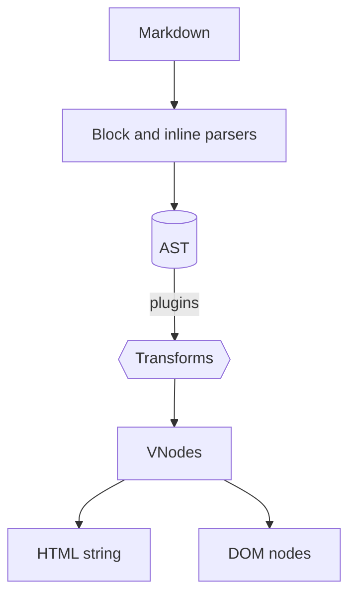
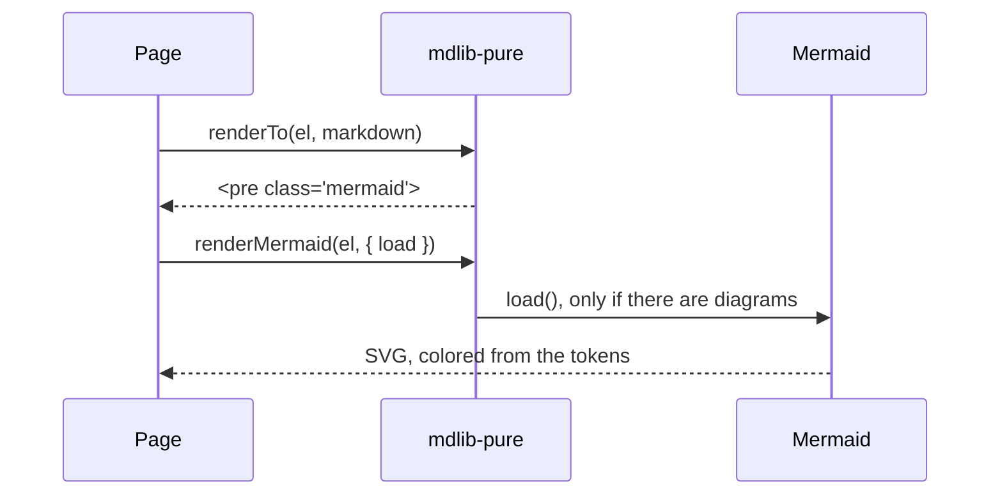

How mdlib-pure turns Markdown into HTML:

```mermaid
flowchart TD
  src[Markdown] --> parse[Block and inline parsers]
  parse --> ast[(AST)]
  ast -->|plugins| transforms{{Transforms}}
  transforms --> vnodes[VNodes]
  vnodes --> html[HTML string]
  vnodes --> dom[DOM nodes]
```

And who calls whom when a page renders a diagram:

```mermaid
sequenceDiagram
  participant Page
  participant mdlib as mdlib-pure
  participant Mermaid
  Page->>mdlib: renderTo(el, markdown)
  mdlib-->>Page: <pre class="mermaid">
  Page->>mdlib: renderMermaid(el, { load })
  mdlib->>Mermaid: load(), only if there are diagrams
  Mermaid-->>Page: SVG, colored from the tokens
```
